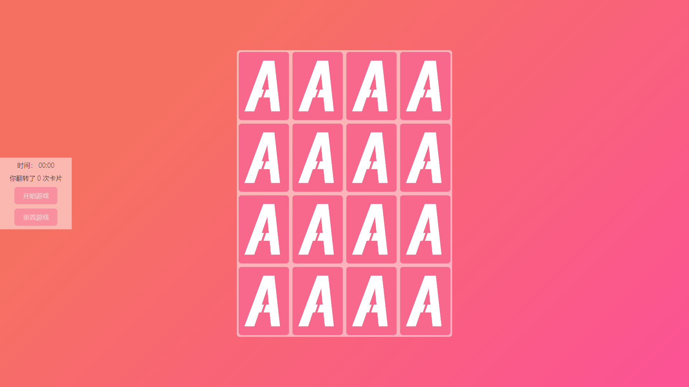
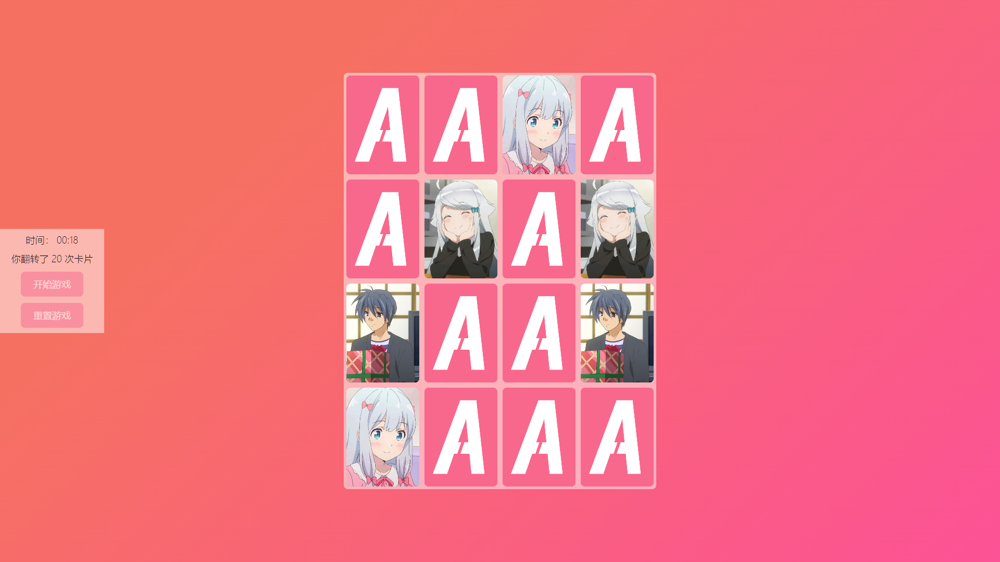

# 二次元风格の记忆翻牌游戏

名称：二次元风格の记忆翻牌游戏

作者：KSaMar

日期：2023-7-11

描述：一个简单的二次元风格の记忆翻牌游戏

## 开发环境

网页制作工具：VSCode

## 简介

参考项目

> https://jpromanonet.github.io/100Projects100Days/day08_jsMemoryGame/

这个项目是参考 github 上的一个 JS Memory Game 制作的，并拓展了一些功能，手动开始游戏，重置游戏，时间显示，翻转次数

## 项目图片

## Bilibili

欢迎在 B 站上关注我

[哔哩哔哩](https://space.bilibili.com/51110915) KSaMar